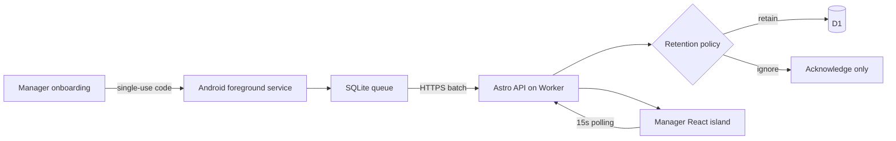

## Context

This is an Android-first collector with a web manager console. Employee devices
are administrator-enrolled and have no tracking stop control.

## Goals / Non-Goals

**Goals:** an Android foreground collector that survives normal lifecycle
events, a useful Astro/React manager dashboard, a typed API, server-side
retention policy, and a D1 schema sized for roughly 100 employees.

**Non-Goals:** iOS, employee shift controls, one-second updates, payroll, route
optimization, device-owner/MDM provisioning, or deployment.

## Decisions

### Split mobile and manager surfaces

Astro owns manager pages, API routes, and the Cloudflare adapter. A React Native
Android app owns enrollment and device status. The continuous runtime is Kotlin,
not JavaScript, because Android background execution cannot depend on the React
Native bridge staying alive.

### Native continuous capture

An Android foreground service uses Google Play Services Location, a visible
ongoing notification, a boot/package receiver, and a native SQLite queue. The
React Native shell enrolls the device and shows health but exposes no stop
control. The service writes every accepted fix before attempting upload.

### Code-bound employee onboarding

An administrator creates the employee assignment in the dashboard with name,
employee code, phone number, team, and retention policy. The API stores only a
hash of a random, short-lived enrollment code and reveals the plaintext code
once. The Android app lists active subscriptions, requires the installer to
select one, and redeems the code with a stable app install ID and SIM snapshot.
Redemption atomically burns the code and returns a random device credential.

The expected phone number from the manager assignment is the source of truth.
Android phone-number APIs are best-effort, so an unavailable or mismatched SIM
number does not block enrollment. Instead, the backend records SIM presence,
slot, carrier, and reported number when available and exposes a warning to the
manager. Every location batch is authenticated by the device credential and
refreshes the SIM snapshot; SIM existence or phone number is never treated as
authentication.

### Worker/D1 backend

D1 stores employees, teams, devices, tracking policies, raw points, latest
locations, summaries, and audit events. The ingestion endpoint acknowledges
valid authenticated points, then retains or discards each according to the
device's assigned server policy. Demo mode remains synthetic and credential-free.

### Status and refresh

Device status is derived from recorded time: Active at two minutes or less,
Stale through ten minutes, and Offline beyond ten minutes. Off duty is a
separate policy state, not a connectivity state. The manager polls every 15
seconds without overlapping requests.

### Map

MapLibre renders employee markers and route lines. The roster is the complete
accessible fallback when map tiles fail. Tile-provider selection remains
configuration.

## Risks / Trade-offs

- **[Risk] OEM battery controls stop the service.** → Use a foreground service,
  boot/task restart paths, and dashboard freshness alerts; validate on pilot devices.
- **[Risk] Continuous collection is sensitive.** → Keep the Android notification
  visible, enforce access scope, audit history, and discard points outside policy.
- **[Risk] SIM numbers are often unavailable or mutable.** → Bind the assignment
  to the manager-entered number, authenticate with a device token, and surface
  SIM mismatch or absence as manager-visible health instead of blocking uploads.
- **[Risk] D1 or tiles are absent locally.** → Use synthetic manager data and a
  visible map fallback; never fabricate production connectivity.

## Migration Plan

Build and verify locally with synthetic data. App signing, distribution,
Cloudflare bindings, Access policy, D1 migration, and deployment require
separate explicit gates.
